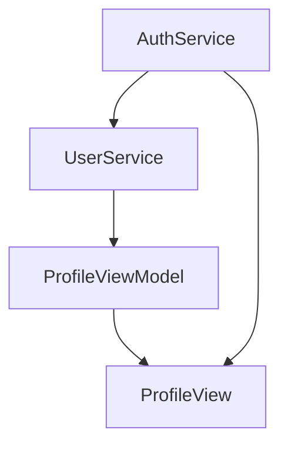

# Authentication & Profile Implementation

## Architecture

### Data Flow


### State Management
```swift
// App-level auth state
@Published var isAuthenticated: Bool
@Published var accessToken: String?

// Profile-level state
@Published var user: User?
@Published var isLoading: Bool
```

## Key Components

### AuthService
- Handles OAuth flow with NeoDB instances
- Manages client registration per instance
- Stores credentials in Keychain
- Supports multiple instances

```swift
class AuthService {
    // Instance management
    var currentInstance: String
    func switchInstance(_ newInstance: String) throws
    
    // OAuth flow
    func registerApp() async throws
    func handleCallback(url: URL) async throws
    private func exchangeCodeForToken(code: String) async throws
}
```

### UserService
- Handles user data fetching
- Implements caching strategy
- Instance-aware caching

```swift
class UserService {
    func getCurrentUser(forceRefresh: Bool = false) async throws -> User
    func clearCache()
}
```

### Cache Strategy
```swift
// Cache key format
"\(instance)_cached_user"

// Cache invalidation
- On logout
- On instance switch
- On force refresh
- On 401 errors
```

## UI Implementation

### Loading States
1. Initial load
   - Show skeleton UI
   - Placeholder avatar
   - Redacted text
   - Background loading indicator

2. Refresh
   - Keep existing content
   - Show loading overlay
   - Support pull-to-refresh

### Avatar Handling
```swift
private let avatarSize: CGFloat = 60

// Size ratios
avatar: 1.0
placeholder icon: 0.5
error icon: 0.8

// Kingfisher Implementation
KFImage(URL(string: user.avatar))
    .placeholder { placeholderAvatar }
    .onFailure { _ in errorView }
    .resizable()
    .aspectRatio(contentMode: .fill)
    .frame(width: avatarSize, height: avatarSize)
    .clipShape(Circle())
```

### Image Loading Features
- Automatic caching
- Placeholder support
- Failure handling
- Smooth transitions
- Memory efficient
- Disk caching

## Error Handling

### Error Types
```swift
enum AuthError {
    case invalidURL
    case networkError(Error)
    case invalidResponse
    case unauthorized
    case registrationFailed(String)
    case tokenExchangeFailed(String)
    case invalidInstance
    case noClientCredentials
}
```

### Error UI
- EmptyStateView for errors
- Placeholder content during loading
- Graceful degradation

## Security Considerations

### Credential Storage
- Use Keychain for sensitive data
- Instance-specific storage
- Clear on logout

### OAuth Implementation
- State parameter for CSRF protection
- Instance validation
- Token refresh handling (TODO)

## Future Improvements

### TODO
- [ ] Token refresh mechanism
- [ ] Offline support
- [ ] Background sync
- [ ] Rate limiting
- [ ] Error retry mechanism

### Performance Optimizations
- Preload avatar images
- Cache size limits
- Background data prefetch

## API Endpoints

### OAuth
```
POST /api/v1/apps
POST /oauth/token
```

### User Data
```
GET /api/me
Response: {
    url: string
    external_acct: string?
    display_name: string
    avatar: string
    username: string
}
``` 