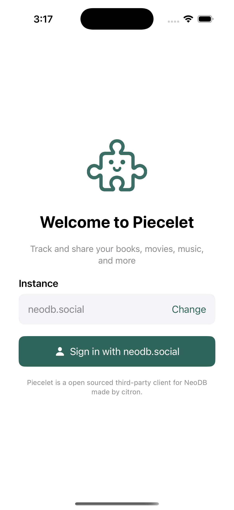
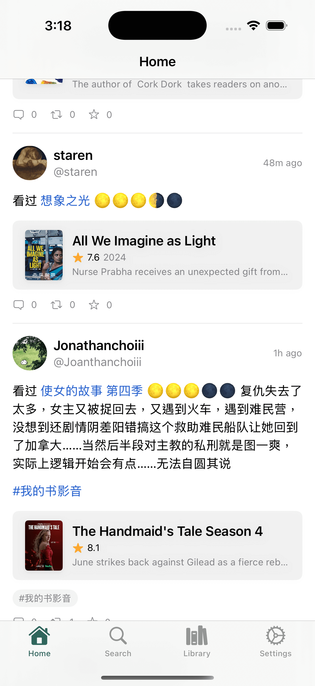
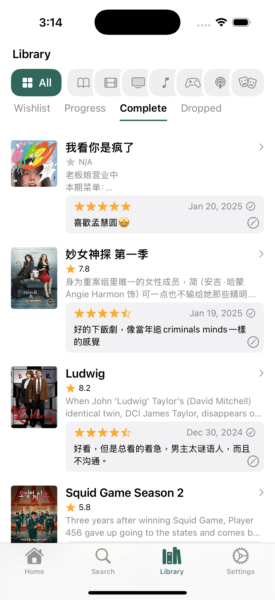
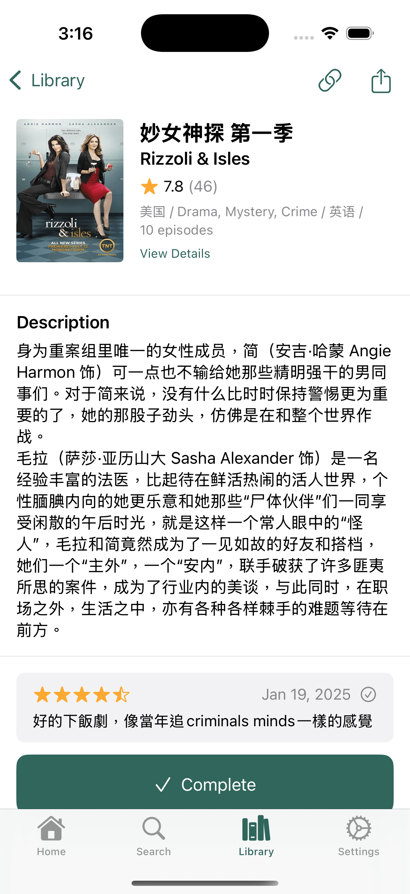

# Piecelet - iOS App for NeoDB

[Public TestFlight beta](https://testflight.apple.com/join/apxemRpF) (An proper App Store release will come eventually)

<a rel="me" href="https://mastodon.social/@piecelet">Mastodon</a> | <a rel="me" href="https://m.cmx.im/@piecelet">Mastodon（中文）</a> | [Bluesky](https://bsky.app/profile/neodb.app)

    
    

    
    

For contributors and myself, here is a todo list of features that could be added (while giving you a good idea of what's already done if not in this list, the app is quite complete already!)

- [ ] DM / Conversations
- [X] Lists support
- [ ] Display images alt
- [ ] Editor: Post image alts
- [ ] Editor: Add / Edit polls
- [ ] Editor: Support video types
- [ ] Editor: Add photos from camera
- [X] Editor: Autocomplete for mentions / hashtags
- [ ] Better settings tab
- [ ] Edit profile
- [X] Light theme
- [X] More themes
- [ ] Honor & display server side features (filter, default visibility, etc...)
- [X] Open remote status locally
- [ ] More context menu everywhere
- [ ] Support pinned posts
- [ ] Support NeoDB://any neodb links
- [ ] Add a share sheet
- [ ] Translate button
- [ ] Proper iPad support
- [ ] macOS support

Piecelet is an open source application for accessing the decentralized social network [NeoDB](https://neodb.net/)! It's built entirely in SwiftUI, making it fast, lightweight, and easy to use.

You can connect to any NeoDB instance and browse your timeline, interact with other users, and post updates and media.

It's a great starting point for learning SwiftUI. The app covers many of the basic concepts of SwiftUI, such as building layouts, working with data, and handling user interaction. By exploring the code, you can gain a solid understanding of how to use SwiftUI in your daily life. Plus, the open source nature of Piecelet means that you can see how real-world applications are built and get a sense of best practices for using SwiftUI.

Please note that Piecelet is currently in an early stage of development and as such, there are many features that are still missing. While the app is functional and can be used to browse and interact with NeoDB, there are still many features that are planned for the future.

Thanks!

## Acknowledgements
- [IceCubesApp](https://github.com/Dimillian/IceCubesApp)
- [keychain-swift](https://github.com/evgenyneu/keychain-swift)

